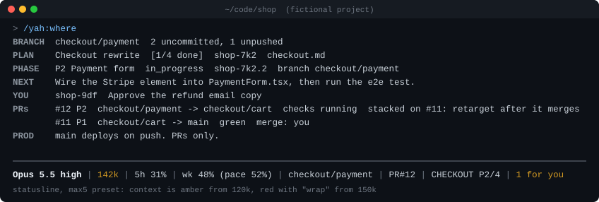

# you are here

```
Opus 5.5 high | 142k | 5h 31% | wk 48% (pace 52%) | checkout/payment | PR#12 | CHECKOUT P2/4
```

`yah` is a Claude Code plugin that shows which plan, phase, PR and next step you're on and tells you when to wrap (write the next step down, commit, then `/clear`), because short sessions that start from written-down state cost far less than long ones that rediscover it.



## Why

- **You lose your place.** A new session does not know your plan, phase, PR or next step, so it re-reads long docs to find out.
- **Sessions run long with no signal to stop.** Opus 5.5, Sonnet 5 and Fable have a native 1M context window on every plan, and auto-compact fired at about 967k (observed in Claude Code 2.1.x). Nothing stops a session at 400k.
- **Idle resumes cost a full cache rewrite.** Resuming after more than an hour idle rewrites the whole prompt cache.
- **Project facts get rediscovered.** Plan state holds open work, not durable facts like "production deploys only from main". Each new session finds them again, in tokens and turns.

The author measured one week of their own usage (2026-09-14 to 09-23, one Max 20x account, about $2,600 at API prices):

| Where it went | Share |
|---|---|
| Main thread | 59% |
| Workflow (ultracode) agents | 30% |
| Subagents | 11% |

**The expensive part was one long session, not parallelism.** 95% of Fable spend was a single main-thread session that ran at 400k to 970k context on xhigh and max effort, and auto-compacted 6 times. Other findings:

- 23 resumes after more than an hour idle, each rewriting the whole cache.
- Sessions started from the home folder, so project memory never loaded. Agents re-read big docs to orient, about 41k tokens in one start.
- Finding "which PR and phase am I on" took 14 lookups.
- Review workflows ran 23 to 30 agents over a handful of files.

This is one person's week, not a benchmark. yah makes the habits that avoid it visible: one task per session, state written down, and a clear signal to wrap.

## What you get

A statusline, three hooks, seven skills, two agents and an optional run driver with two hooks of its own. Stdlib Python, MIT licensed.

| Piece | What it does | What it costs you |
|---|---|---|
| Statusline | One line: model and effort, context (green, amber, then red with "wrap"), 5-hour and weekly use with pace, branch, PR, plan phase, items waiting on you, and "cache cold" after an hour idle. | About 35–70 ms per refresh on Windows, depending on the machine, and 55 ms in WSL (median of 25 runs), run locally. It never runs git, gh or bd. The model does not see it. |
| SessionStart hook | Injects up to 6 lines of state (branch, plan, phase, NEXT, top PR, PROD) at startup, `/clear`, compact and resume, and asks the model to restate phase, NEXT and what waits on you in one line before its first tool call. A NEXT older than later commits on the phase branch is flagged `/yah:wrap first`. If the plan or a CLAUDE.md names another plugin's `/x:wrap`, `/x:where` and so on, the block maps them to yah's. | About 125 tokens (495 characters in the S7 test run), plus about 40 when it maps another plugin's names, on every turn: it stays in the prompt, so it is part of the per-turn total in the listing row below. It also runs `git`, plus `gh pr list` (over the network), and `bd list` only in a repo with `.beads/`, before the session starts; a slow `gh` or `bd` can add up to about 8–10 s. |
| Context guard | A UserPromptSubmit hook. It nudges once at the wrap mark, once at wrap now, once per session on a premium model, once a day when weekly use runs ahead of pace, and once per session when the session runs an older yah than the one installed. It never blocks. | One local Python run per prompt. A short message only when a nudge fires. |
| Brain recall | A UserPromptSubmit hook. On a session's first prompt it injects the [brain](#the-brain) notes that match the prompt, the phase and your changed files. | 0 when the repo has no brain folder. Otherwise once per session, capped at about 2.5k tokens, usually a few hundred. Recall over 100 notes took about 80–130 ms. |
| `/yah:where` | The full view in up to 15 lines: branch (with no upstream, how far ahead of its base), plan, phase, NEXT and whether commits have made it stale, what waits on you, the PR stack and the PROD warning. | Runs git, plus `gh` if installed, and `bd` only in a repo with `.beads/`. The output enters your context. |
| `/yah:auto` | The launcher's first prompt, so a session starts without you typing. It reads the injected state and runs the step it calls for. An open plan phase starts `yah run --plan --detach` (autopilot, which goes on after the session closes); `/yah:auto here` does the step hands-on through `/yah:start` instead. It reports a live run, and for one that ended offers a rerun, `/yah:deep` or hands-on work. It asks a `NEEDS-HUMAN` question, writes the answer into NEXT and starts the run again, checks a PR that waits on you, fixes failing checks or review comments, tracks a newly approved plan with `/yah:phases`, sends a hard question to `/yah:deep` on any tier, and ends with `/yah:wrap`. With no plan it asks what to build; it never invents a task. | One turn to pick the step, then that step's own cost. Hidden from the model, so no listing cost. |
| `/yah:start` | Starts a task: restates the task, phase and first step from the injected state before any tool call, runs one recall on the task's key nouns, allows at most one targeted search, then makes the edit. Offers to create a brain folder if there is none. | One turn plus the recall output. |
| `/yah:wrap` | Ends a task. Rewrites NEXT in STATE.md, ticks off finished items, writes at most one brain note, commits WIP on the feature branch, stamps NEXT with that commit and saves durable lessons to memory. When the phase is done it runs a review if available, pushes, opens the PR and claims the next phase. Ends with "Safe to /clear", and with a plan phase open, says `/yah:auto` hands it to autopilot. | One turn in your session. Writes in your repo. |
| `/yah:phases` | Turns an approved plan into phases in STATE.md. | One turn. Writes in your repo. |
| `/yah:deep` | Sends one self-contained hard question to Fable in a forked agent (high effort, read-only, 300 words or fewer). Works on every tier: when the account cannot use Fable, Claude Code runs the agent on the session's model. | Fable usage. See the plan table. |
| `scout` agent | Read-only lookups on Sonnet at low effort. Answers in 150 words or fewer. | Sonnet tokens instead of main-thread tokens. |
| `yah run` and `/yah:resume` | Chains fresh headless sessions, one bounded slice each, until the phase's PR is open and green, then stops; with `--plan`, through every open phase. The merge is yours unless you turn on [auto-merge](#auto-merge-opt-in). See [Hands-free runs](#hands-free-runs-yah-run). | Your normal plan usage: one full session per iteration, each capped by `--max-budget-usd`. |
| PostToolUse guard | The context guard again after each tool call, so wrap nudges reach a headless session, which has only one prompt. | Only inside `yah run` iterations: one local Python run per tool call. Interactive sessions never run it. |
| Push guard | A PreToolUse hook on Bash and PowerShell that denies force pushes, pushes to protected branches and merges. See [Rails](#hands-free-runs-yah-run). | Only inside `yah run` iterations: one local Python run per Bash call. Interactive sessions never run it. |
| Ultracode opt-in | Max 20x only, offered by `/yah:setup`: ultracode on in every session with workflows capped at medium size, plus a once-per-session rule for sizing workflows. See [Ultracode on Max 20x](#ultracode-on-max-20x). | About 80 tokens once per session. The spend is ultracode's own: xhigh effort and workflow agents. |
| Skill and agent listing | The short descriptions Claude Code lists so the model knows these exist, each 92 characters or fewer. `/yah:auto`, `/yah:resume` and `/yah:setup` are hidden from the model. | Measured in one clean A/B pair against a no-plugin session: +593 tokens per turn in total. Of that, the skill listing is about 125 tokens (493 characters), the agent listing about 75 (299 characters) and the SessionStart block about 125; the other ~270 were not attributed (likely wrapper text and noise). Since that run the SessionStart block gained its restate rule (104 characters, about 26 tokens) and the wrap description 7 characters. If you append RULES.md through setup, add about 320 tokens (about 1,270 characters) per turn. |
| `/yah:setup` and the `yah` launcher | Sets the statusline and your tier. Optionally adds a `yah <project>` shell function that cds into a project and starts `claude` on `/yah:auto`; `yah run` goes to the run driver. | Changes `statusLine` in settings.json, after a backup. Each step asks first. |

## Install

```
/plugin marketplace add ARYN26/you-are-here
/plugin install yah@you-are-here
/yah:setup
```

A plugin cannot set the statusline, so `/yah:setup` does it. It asks your tier, shows a dry run, and applies only after you say yes. Then it offers auto-update (see below), [auto-merge](#auto-merge-opt-in) for `yah run`, the `yah` launcher, and to append [RULES.md](RULES.md) to `~/.claude/CLAUDE.md` (about 320 tokens on every turn). Each step needs your yes.

You can also run setup from a terminal (use `python` on Windows):

```
python3 "$HOME/.claude/plugins/marketplaces/you-are-here/scripts/setup.py" --tier max5 --dry-run
```

Flags: `--tier pro|max5|max20|api`, `--dry-run`, `--uninstall`, `--python CMD`, `--launcher bash|zsh|fish|powershell|cmd` (prints the snippet), `--install-launcher RCFILE` (a `.cmd` path, or a folder on Windows, gets a whole `yah.cmd`), `--install-rules [FILE]` (appends RULES.md as a marked block; default `CLAUDE.md` in the Claude config folder), `--ultracode` (opt-in, see below), `--auto-update` (opt-in, runs on its own: turns on Claude Code's auto-update for yah's marketplace and changes nothing else), `--auto-merge` (opt-in, runs on its own: sets `auto_merge` in config.json and changes nothing else; see [auto-merge](#auto-merge-opt-in)) and `--yes` (no prompts).

**Updating**

yah sets no version number, so every commit to main counts as a new version. Claude Code does not auto-update third-party marketplaces unless you turn it on, and a plugin author cannot change that default. `/yah:setup` offers to turn it on for you (`setup.py --auto-update`), or do it yourself: `/plugin` → **Marketplaces** → `you-are-here` → **Enable auto-update**. Without that, update by hand with `claude plugin update yah@you-are-here` (or `/plugin` → **Installed** → yah → **Update now**), then run `/reload-plugins` or start a new session. `/clear` is not enough: a session keeps the yah it loaded until one of those, so yah tells you once per session when a newer one is installed. The statusline and the launcher run from the marketplace clone, so they pick up the update too.

Running a fork of yah, or another plugin with the same hooks? Disable it while yah is installed (`/plugin disable <name>`); otherwise every hook and skill listing runs twice.

**Requirements**

- **Claude Code:** tested with 2.1.280. `yah run` needs a version that supports `--permission-prompts`.
- **macOS:** needs `python3` 3.9+, from the Xcode Command Line Tools or Homebrew. Without the Command Line Tools, `/usr/bin/python3` opens an install dialog, so setup times out its probe and tells you to run `xcode-select --install` or `brew install python`. zsh gets the launcher.
- **Linux:** needs `python3` 3.9+. bash gets the launcher.
- **Windows:** needs Python 3.9+ from python.org or winget, plus Git for Windows. Claude Code runs hooks in Git Bash there. Setup tries `python`, then `py -3`, then `python3`, because `python3` on Windows is often the Microsoft Store stub. PowerShell gets the launcher. cmd.exe loads no profile, so for cmd setup writes a `yah.cmd` into a folder on PATH instead (next to `claude` by default): `--install-launcher <folder>\yah.cmd`. After Ctrl+C in Claude, cmd may ask "Terminate batch job (Y/N)?"; that is cmd, not yah. Without Git Bash, Claude Code falls back to PowerShell for hooks, and yah's hooks cannot run there (the statusline still works). Setup warns when it cannot find Git Bash.
- **Optional:** `gh` adds the PR lines, and `yah run` needs it to follow the PR. Plan state lives in a `STATE.md` file in the repo, so there is nothing to install (see [Plan state: STATE.md](#plan-state-statemd)). A repo that already uses beads can keep it (see [If you already use beads](#if-you-already-use-beads)).

## The daily loop

1. **Start in the project.** Run the launcher:
   ```
   yah shop
   ```
   It cds into the repo and starts `claude` with `/yah:auto` as the first prompt, so there is nothing to type: it starts or reports the detached `yah run` for an open phase (`yah shop here` works hands-on instead), asks a `NEEDS-HUMAN` question, checks a PR that waits on you, or, with no plan, asks what to build. `yah shop add Apple Pay to the payment form` hands it that task instead. Flags go straight to `claude` with no prompt, e.g. `yah shop --resume <id>`. Run `yah` alone to list projects. If two repos share a folder name, `yah NAME` lists both and refuses; give one a key under `projects` in config.json. Starting from the home folder means project memory does not load. The SessionStart hook tells the model where you are.
2. **The step runs through the yah skills.** `/yah:auto` calls `/yah:start` for a task, `/yah:phases` when a new plan is approved, `/yah:deep` for a hard question and `/yah:wrap` at the end. You can call any of them yourself:
   ```
   /yah:start "add Apple Pay to the payment form"
   ```
   It restates the task, phase and first step before any tool call, recalls the brain notes that apply, does at most one targeted search, then edits. Typing the task plainly works too: the first prompt gets brain recall either way.
3. **Work one task.**
4. **Wrap when the statusline says wrap, then clear:**
   ```
   /yah:wrap
   /clear
   ```
5. **Resume.** The fresh session gets PLAN, PHASE and NEXT injected, so it starts on the next step without reading docs. After `/clear`, type `/yah:auto`; from a terminal, `yah shop` sends it for you. If the statusline says "cache cold", `/clear` beats resuming the old session.

A new multi-phase plan was just approved? Run `/yah:phases` before its first phase. Want steps 2 to 5 repeated without you? See [Autopilot](#autopilot).

## Autopilot

You decide at the start; the rest runs without you.

1. **Give it the task.** `yah shop add Apple Pay and refunds`, or `yah shop` and answer what to build. A task that needs several PRs goes to plan mode. Claude explores, then drafts stacked phases, each with a done-when, a branch and a base. It sends the draft to `/yah:deep`, which lists the decisions and risks the plan leaves open.
2. **Answer everything once.** Before it shows the plan, Claude asks you every one of those decisions, a few questions at a time, and writes the answers under `## Decisions` in the plan file. A headless session can still stop with a `NEEDS-HUMAN` question, but only for what nobody could foresee.
3. **Approve the plan.** `/yah:phases` writes it to STATE.md and `/yah:auto` starts `yah run --plan --detach`. The session can close; the run goes on in fresh headless sessions, one phase after another (see [`yah run`](#hands-free-runs-yah-run)).
4. **PRs.** With auto-merge off (the default), each green PR waits for you and the next phase stacks on its branch. With [auto-merge](#auto-merge-opt-in) on, the run merges each green PR it opened and builds the next phase on where it merged.
5. **Check in.** `yah shop` or `/yah:where` shows the RUN line. While the run lives, `/yah:auto` only reports it and offers to end it. When it stops you get a desktop notification, and `/yah:auto` asks its `NEEDS-HUMAN` question and starts it again, or for a run that stopped offers a rerun, `/yah:deep` on why, or hands-on work.

`yah shop here` opts out: an open phase runs in the session through `/yah:start`, as in the daily loop.

## The brain

Plan state (STATE.md) holds open work and is rewritten every session. Durable facts, such as "Vercel builds production only from main" or "the API rate-limits at 10 rps, batch writes", live nowhere, so each session rediscovers them. The brain is a folder of one-fact notes in your repo, `docs/brain` by default (`brain_dir` in config). It is plain markdown: no database, no embeddings, no MCP server. The folder opens as an Obsidian vault.

**Start one** with `/yah:start "<task>"`. If the repo has no brain folder, it says so once and offers `brain.py init`, which creates the folder with `README.md`, `_pending.md` and `INDEX.md`. It never creates one unasked. Every brain feature stays silent in a repo without the folder.

**A note** is `<brain_dir>/<slug>.md`:

```markdown
---
title: Vercel deploys only from main
tags: [deploy, vercel]
paths: ["vercel.json", ".github/**"]
status: active
source: PR #41, 2026-09-20
---
Vercel builds production only from main; previews come from PR branches.
Optional detail. Links: [[preview-env-vars]].
```

- The slug is lowercase `a-z`, `0-9` and dashes, 60 characters or fewer.
- Frontmatter is flat `key: value`, with lists as `[a, b]`. No nesting and no multi-line values.
- The first body line is the TL;DR, 200 characters or fewer. `[[slug]]` links another note.
- `paths` are globs (`**` means any depth). A note whose glob matches a file changed on your branch ranks higher.

**Rot rules**

| Rule | How it works |
|---|---|
| At most one note per wrap | `/yah:wrap` asks whether the session established a durable fact or decision a future session would otherwise rediscover. Progress goes in NEXT and preferences go in memory. It runs `brain.py find` first, then updates, supersedes or adds, and commits the note with the WIP commit. |
| A source is required | A PR, commit sha, issue, URL, `path/to/file:line`, or `user, YYYY-MM-DD`. Without one, `brain.py new` appends the note to `_pending.md` instead, for you to accept or drop (`brain.py pending` lists them). |
| Supersede, never delete | `brain.py new --supersedes <old-slug>` marks the old note `status: superseded` with `superseded_by`. |
| INDEX.md is generated | Rewritten after every write, sorted by slug, never hand-edited. Each rewrite warns about missing sources, broken links and a `superseded_by` that points nowhere. |

**What gets injected, and when.** On the first prompt of a session, a UserPromptSubmit hook ranks the active notes and injects the top 5 TL;DRs with their sources, up to 10 more slugs and the pending count. Later prompts in that session get nothing. A repo with no brain folder does not use up the session's recall, so a brain made mid-session still gets one. Slash commands are skipped, and the first plain prompt after them still gets recall; `/yah:start` and `/yah:resume` run their own. The block is capped at `recall_max_chars` (10,000 characters, about 2.5k tokens) and is usually a few hundred tokens:

```
[yah] brain: 3 of 18 notes match "add Apple Pay to the payment form" (docs/brain, full list in INDEX.md)
- stripe-webhooks-idempotent: Stripe retries webhooks; handlers dedupe on event.id. (PR #31, 2026-09-02)
- payment-form-tests-use-test-clock: E2E tests pin time with a Stripe test clock. (tests/e2e/pay.spec.ts:14)
- no-client-secret-in-logs: Never log a PaymentIntent client_secret. (user, 2026-09-10)
1 unreviewed note in docs/brain/_pending.md
```

Ranking is word overlap, not semantic search. The title counts 3, tags 2, the TL;DR 1, and the current phase and NEXT 1.5 against the title and tags. Words are lightly stemmed (pushes, pushed and pushing all match push), and short terms like PR, UI, CI and DB count. A `paths` glob matching a changed file (`git diff <base>...HEAD` plus `git status`, 3 s timeout each) adds 4, or 2 when no word matched, and a link to or from a top-5 note adds 1 to a note that already matches. A note whose words never come up will not surface; INDEX.md is the full list. Claude runs `brain.py` for you: `recall`, `find`, `new`, `index`, `init` and `pending`, each with `--cwd DIR`. brain.py writes only inside the brain folder.

## Hands-free runs: `yah run`

Claude Code cannot `/clear` itself or start a new session from inside one. No hook, skill or tool can. So the wrap, clear, continue loop needs an outside driver, and `yah run` is that driver. Run it in a terminal, or start it from a session with `--detach`:

```
yah run [TARGET] [--plan] [--cwd DIR | --project NAME] [--iterations N] [--budget USD] [--model M] [--plugin-dir DIR] [--dry-run] [--detach]
yah run --stop [--cwd DIR | --project NAME]
```

Without the launcher, run `python3 "$HOME/.claude/plugins/marketplaces/you-are-here/scripts/run.py"` with the same arguments (`python` on Windows). Try `--dry-run` first.

| Argument | Meaning |
|---|---|
| `TARGET` | `P<n>` (a plan phase), `#<pr>`, or empty for the current phase. Shells treat `#` as a comment, so pass `12` or `'#12'`. A `P<n>` with no such phase is refused (exit 5). An empty TARGET is pinned to the current phase at start, so a wrap that claims the next phase cannot move the run. |
| `--plan` | Go on past exit 0: once the phase's PR is open and green (or merged) and the phase is closed, run the next open phase, until none is left. TARGET must be `P<n>` or empty; an empty one works from a trunk checkout too, since the plan names the phase. See [Whole plans](#whole-plans---plan). |
| `--cwd DIR`, `--project NAME` | The repo to run in. Default: the current folder. `--project` refuses (exit 5) when two known repos share the name; use `--cwd` then. |
| `--iterations N` | Max sessions per phase. Default `run_iterations`, 8. |
| `--budget USD` | `--max-budget-usd` per session. Default `run_budget_usd`, by tier (below). |
| `--model M`, `--plugin-dir DIR` | Passed to `claude`. Without `--plugin-dir`, a run.py started from a yah checkout (not from `plugins/cache` or `plugins/marketplaces`) passes `--plugin-dir <checkout>` itself, so each session has `/yah:resume`. `--dry-run` prints which one it used. |
| `--dry-run` | Prints the resolved argv, the DENY list, the caps and what it would do now. Spawns nothing, but still calls `gh`. |
| `--detach` | Runs in the background and returns once the run has started (exit 0), or with the run's own exit code if it stopped first. On Windows it has no console window, so closing the terminal or ending the Claude Code session does not end it; elsewhere it gets its own session, so SIGHUP never reaches it. Its output goes to `<data dir>/runs/<project>-<time>.out` beside the `.log`. |
| `--stop` | Ends the run going in this checkout: the driver, the session it is in and every process under them. The pid file then says exit 130, "ended by yah run --stop", so the RUN line shows the run ended. A session cut off mid-edit can leave uncommitted work in the tree. With no live run it says so and exits 0. `/yah:auto` offers it when a session starts in a checkout a run is working in. |

**The loop.** Each iteration runs one headless session in the repo:

```
claude -p "/yah:resume P2 build" --permission-mode auto --permission-prompts none --disallowedTools <DENY...> \
  --max-budget-usd 10 --output-format stream-json --verbose \
  --settings '{"hooks":{"PreToolUse":[...push_guard.py],"PostToolUse":[...context_guard.py]}}'
```

`/yah:resume` orients with where.py and brain recall, gets on the phase branch (its instructions rule out trunks and PROD), does one bounded slice toward NEXT, runs the tests, follows `/yah:wrap` and ends with a `YAH-RESULT:` line. A decision that needs you becomes NEXT = `NEEDS-HUMAN: <question>`. Before and after each iteration, run.py reads the PR (`gh pr view`, then `gh pr checks`, required checks first) and the phase (where.py). Pending checks are polled every 30 s for up to `run_checks_wait_minutes`. Failing checks make the next slice `fix-checks`, which reads the failing CI logs. A CHANGES_REQUESTED review newer than the head commit makes it `address-review`.

**Stop rules.** Checked before and after each iteration. The first match wins:

| Exit | When |
|---|---|
| 6 | The PR was merged or closed. With `--plan`, a merged PR whose phase is closed moves on to the next phase instead. |
| 8 | With `auto_merge` on, where 0 would stop: the PR met every [auto-merge](#auto-merge-opt-in) rule and yah merged it, "merged by yah". With `--plan`, the run goes on to the next phase instead. |
| 0 | The PR is open, its checks pass (or it has none), no CHANGES_REQUESTED review is newer than the head commit, and the phase is closed (or TARGET was a PR). "The merge is yours." With `auto_merge` on, it also says which merge rule was not met. With `--plan`: no open phase is left, "plan done", with each phase's PR. |
| 2 | The last session needs you: it ended in an error (a timeout included), a permission was denied during it, it ended `needs-human` or `blocked`, or it ended without a `YAH-RESULT:` line (usually the plugin was not loaded). Also a failed auto-merge step. The denial or question is printed. |
| 3 | Stalled: HEAD and NEXT unchanged for 2 iterations in a row. |
| 4 | The iteration cap, or `run_total_hours` of wall clock. |
| 7 | Weekly usage at or over `run_week_stop_pct`, or more than `pace_slack` points ahead of pace. |
| 5 | Refused: not a git repo, on a trunk or the PROD branch with no TARGET, `claude` not on PATH, `gh` missing, an invalid TARGET, a `P<n>` with no such phase, an unknown or ambiguous project, or no way to name the branch the PR targets (no base in the plan, no open PR, no `origin/HEAD` and no `prod` in config), so it cannot be protected. That last check also runs before each iteration. Also another run already going in this checkout (below). |
| 1, 130 | run.py itself failed, or you pressed Ctrl-C or ran `yah run --stop`. |

**One run per checkout.** A run holds a lock on `<data dir>/runs/<project>-<hash>.pid` (`<project>-<hash>@<worktree>.pid` in a linked worktree; the hash keeps two repos with one folder name apart), a JSON file with its pid, target, log and, once it stops, its exit code and reason. A second run in the same checkout is refused while the first lives. The OS drops the lock when the driver dies, so a pid file whose lock is free is a run that ended, even after a crash or a reboot. `/yah:where`, the session-start block and the statusline show it as the RUN line: while it runs, its target and the log's last line; once it ends, its exit code and reason (for 3 days), or `died` when it was killed before it could say.

#### Whole plans: `--plan`

`yah run --plan` keeps going where a plain run stops. When the phase's PR is open and green (or merged) and its phase is closed, it pins the next open phase and runs that. It stops with exit 0, "plan done", when no open phase is left in the plan it started on (another `## Plan:` below is not run). It stops with exit 2 when the next phase is marked `(you)`, or when the finished phase's last session asked for you or hit a denial. Unless `auto_merge` is on, it never merges: each green PR waits for you, and the finished phase's branch is protected for the rest of the run.

A new phase's base comes from the plan. There are two exceptions, and in both `/yah:resume` gets `base=<branch>` and writes it to the phase line:
- If the plan's base is another phase's branch whose PR has merged, the phase builds on where that PR merged, since the branch may be gone.
- If the phase has no base, it stacks on the phase the run just finished, while that PR is open.

The iteration cap is per phase. `run_total_hours` and the weekly pace hold for the whole run. `--dry-run` prints the phase order with each base.

#### Auto-merge: opt-in

Off by default: a run stops at a green PR and the merge is yours. `/yah:setup` offers to turn it on (`setup.py --auto-merge`, which sets `auto_merge: true` in config.json). Only a JSON `true` counts; `"true"` or `1` leaves it off. `/yah:where` then shows `auto-merge: on` on a green phase PR instead of `merge: you`.

With it on, the driver merges, never the model: `gh pr merge` stays on the DENY list and the push guard still denies it in every session. The driver merges only when all of these hold:
- at least one check ran, and every check passed;
- GitHub says it is `MERGEABLE`, with merge state `CLEAN` or `HAS_HOOKS`;
- it is not a draft;
- no CHANGES_REQUESTED review is newer than the head commit;
- you opened it: its author is your `gh` user;
- it is the PR of the plan phase the run is on;
- it does not target another phase's branch (a stacked PR waits until the PR below it merges and it is retargeted);
- the last session did not end in an error, a denial, `needs-human` or `blocked`.

It reads the PR again once its checks pass and judges only that read, since the wait for checks can be long: a review, a draft or a new commit that lands during the wait stops the merge.

Then, in this order: `gh pr merge <N> --merge --match-head-commit <sha>` (a merge commit, never a squash, and only if the head has not moved); each open PR based on the merged branch is retargeted to the merged PR's base; the merged branch is deleted on GitHub, never a protected one. Retargeting comes first because GitHub closes a PR whose base branch is deleted, which is also why it never passes `--delete-branch`. The run stops with exit 8, "merged by yah"; with `--plan` it goes on, and the next phase builds on the merged PR's base. A rule not met leaves the PR to you (exit 0 says which), and a failed merge step stops the run with exit 2.

**Rails.** Every iteration gets two layers. Neither is a sandbox (see Limits). run.py never passes `--bare`, `bypassPermissions` or `--dangerously-skip-permissions`. Protected branches are `main`, `master`, your `trunks` (default also `develop` and `dev`), the branch your `prod` text names, and, with no config needed, what where.py infers from git alone: the plan's phase bases, the branch open PRs land on (cached, so a closed PR still counts), `origin/HEAD`, and on a work branch the nearest branch on its first-parent chain, the one it was cut from (a branch merged into it, like a docs PR, is not one). When that chain holds only trunks, the nearest branch merged into it is protected too: a base synced in with `git merge` looks just like a merged docs PR to git. The set only grows during a run, including the base of the PR it follows. No session can merge; with `auto_merge` on, the driver merges between sessions (see [Auto-merge](#auto-merge-opt-in)).

- **Push guard.** `scripts/push_guard.py`, a PreToolUse hook on Bash and PowerShell, added through `--settings` for run iterations only. It parses each command, including `git -C path push`, `git -c key=value push`, `cd x && git push` and combined short flags like `-uf`, and denies:
  - force pushes, `+` refspecs, `--mirror`, `--all`, `--delete`/`-d`, `:branch` deletes, wildcard refspecs and `--prune`;
  - any push whose destination is a protected branch;
  - a bare `git push` or `git push origin HEAD` while the current branch is protected;
  - `gh pr merge`, merges through `gh api`, and `gh repo delete`.

  It also checks commands inside `bash -c` and `eval`. A `git push` it cannot parse is denied. When a push is denied, the session ends with `YAH-RESULT: blocked push denied` and the run stops (exit 2).
- **DENY list.** The second layer: glob patterns passed as `--disallowedTools`, which `--dry-run` prints in full. The PowerShell tool is turned off entirely, since its commands would bypass Bash patterns. The patterns cover force pushes (`git push --force*`, `-f*`, `*--force*`, `* -f*`, any `+`), `gh pr merge*`, `gh api *merge*`, `gh repo delete*`, the delete, mirror, all and prune flags, and for each protected branch B: `git push * B`, `* B *`, `* HEAD:B*`, `* *:B*` and `*refs/heads/B*`.

**Caps.** All are `config.json` keys:

| Key | Default | Meaning |
|---|---|---|
| `run_iterations` | 8 | Max sessions per phase. |
| `run_budget_usd` | pro 5, max5 10, max20 15, api 5 | `--max-budget-usd` per iteration, from your tier. |
| `run_iteration_minutes` | 45 | Wall clock per iteration, or the time left in the run if that is less. At the cap the whole process tree is killed. |
| `run_total_hours` | 6 | Wall clock for the whole run. |
| `run_checks_wait_minutes` | 30 | How long to wait for pending PR checks. |
| `run_week_stop_pct` | 80 | The weekly usage % that stops a run. |

**Logs and notifications.** The console shows one line per tool call and a summary per iteration: cost, turns, result, HEAD and NEXT. The data folder keeps `runs/<project>-<YYYYmmdd-HHMMSS>.log` (those summaries and the stop reason) and `runs/<project>-<YYYYmmdd-HHMMSS>-<n>.jsonl` (iteration n's raw stream), for the 20 newest runs. The `.jsonl` files hold every tool input and output of the session, including any secret it read, such as a `.env` file. On stop it prints the reason, the PR URL, the total cost, the iteration count and the log path, rings the terminal bell, and sends a desktop notification: `osascript` on macOS, `notify-send` on Linux, a PowerShell balloon tip on Windows. Notification failures are ignored.

**Limits, plainly**

- **It spends your normal plan usage.** Each iteration is a full Claude Code session that counts against your 5-hour and weekly limits. On an API key it is billed per token.
- **`--max-budget-usd`** is Claude Code's own per-session cap on the cost it computes. yah passes it through, and the costs yah prints are that same figure. A run's ceiling is about iterations × budget, for example 8 × $10 with the `max5` preset.
- **It feeds other people's text to an unattended session.** fix-checks and address-review read PR comments, review text and CI logs. `/yah:resume` is told to treat them as data, but that is an instruction, not a guarantee. Run `yah run` only on repos where you trust everyone who can comment or push.
- **The rails are not a sandbox.** The push guard parses Bash commands and the DENY list matches patterns. A push run from inside a script or another program is a command neither one sees, so it gets past both. Turn on branch protection for your trunk and prod branches: no force pushes, no direct pushes, PRs required.
- **A denial ends the run after that session.** Runs use auto permission mode, where a classifier reviews actions, with prompts denied. A denied action, a push-guard or DENY hit included, is refused but does not stop the session; when the session finishes, the run stops with exit 2. Auto mode must be available for your account and model; a session that starts in another mode is killed at once and the run stops with exit 2, rather than burn a session on denials.
- **The weekly-pace stop needs a reading.** It uses the rate-limit event in the session's stream, else the statusline's last reading (`limits.json`, if under 6 h old). With neither, it logs "pace unknown" and does not stop on pace.

## Recommended settings per plan

| Plan | Claude Code included? | Main model | Effort | Fable | Parallel agents / ultracode | yah tier preset (amber / wrap / wrap now) |
|---|---|---|---|---|---|---|
| Free | No | n/a | n/a | n/a | n/a | n/a |
| Pro ($20/mo, $17 yearly) | Yes | Sonnet 5 for most work; Opus 5.5 for hard steps* | Medium or lower | Needs extra-usage credits | Avoid* | `pro` 100k / 120k / 160k |
| Max 5x ($100/mo) | Yes | Opus 5.5 or Sonnet 5* | Medium* | Up to 50% of the weekly cap, own usage bar. Only via `/yah:deep`* | Only for genuinely parallel work* | `max5` 120k / 150k / 200k (default) |
| Max 20x ($200/mo) | Yes | Opus 5.5* | High, or ultracode by default via the opt-in* | Up to 50% of the weekly cap, own usage bar. Only via `/yah:deep`* | Ultracode workflows at medium size, for genuinely parallel work* | `max20` 150k / 200k / 260k |
| Team standard ($25/mo, $20 yearly) | Yes | Sonnet 5 for most work | Medium or lower | Via credits | Avoid* | `max5`* |
| Team premium ($125/mo, $100 yearly) | Yes | Sonnet 5 for most work; Opus 5.5 for hard steps* | Medium* | Up to 50% | Only for genuinely parallel work* | `max5`* |
| Enterprise | Yes | Sonnet 5 for most work; Opus 5.5 for hard steps* | Medium* | Premium seats up to 50%; standard seats use credits | Only for genuinely parallel work* | `max5`* |
| API key | Pay per token (Opus 5.5 is $4/$20 per MTok) | Sonnet 5 for most work | Medium or lower | Pay per token | Agent teams use about 7x the tokens | `api` 80k / 100k / 150k |

Cells marked * are the author's judgement calls. Prices are as of September 2026: plans from [claude.com/pricing](https://claude.com/pricing), API from [the API pricing page](https://docs.claude.com/en/docs/about-claude/pricing). Everything else comes from the sources below.

- **Official cost advice:** `/clear` between tasks (`/compact` is itself a large request), Sonnet for most work, lower effort, subagents for long output, and trim MCP servers and CLAUDE.md. Agent teams use about 7x the tokens.
- **Effort** levels are low, medium, high, xhigh and max. Opus 5.5 defaults to medium.
- **Limits:** all subscription plans have a rolling 5-hour window plus a weekly cap, shared with claude.ai.
- **Statusline usage numbers** (5h and wk) come from Claude Code's `rate_limits`. Observed in Claude Code 2.1.x: it appears only for Pro and Max subscribers, after the first response, and never for API keys.
- **Tier presets** are starting points, not official numbers. There is no official mapping for Team or Enterprise, so start at the default and adjust.

Sources, as of September 2026: [claude.com/pricing](https://claude.com/pricing), support articles [15424964](https://support.claude.com/en/articles/15424964), [11049741](https://support.claude.com/en/articles/11049741) and [17007452](https://support.claude.com/en/articles/17007452), and the Claude Code docs on [model config](https://code.claude.com/docs/en/model-config), [statusline](https://code.claude.com/docs/en/statusline) and [costs](https://code.claude.com/docs/en/costs).

## Ultracode on Max 20x

Ultracode runs the main thread at xhigh effort and lets Claude orchestrate workflows of parallel agents. It gives the best results on a Max 20x plan, but a workflow can burn more tokens than doing the same work in the conversation. `/yah:setup` on `max20` offers it as an opt-in (`setup.py --ultracode`). That sets:

- `ultracode: true` in `settings.json`, so every session starts with it on;
- `workflowSizeGuideline: "medium"`, so workflows stay under 10 agents;
- `ultracode: true` in yah's `config.json`, which turns on two nudges:
  - **Once per session:** questions, single-file edits and small reviews stay in the main thread. A workflow is only for genuinely parallel work, with one agent per independent unit, low or medium effort for mechanical stages, high for research and judges, one verifier per finding, and reports of 1,500 characters or fewer.
  - **When weekly use runs ahead of pace:** keep workflows under 5 agents, and suggest `/effort high` for work that is not parallel. Changing effort does not rewrite the cache.

The wrap marks stay at 150k / 200k / 260k. Workflow agents run in their own contexts, so the main thread stays short. `yah run` sessions inherit ultracode too, and each one is still capped by `--max-budget-usd`. `--uninstall` puts the previous values back.

## What it reads, writes and never does

**Reads**

- Claude Code's statusline JSON on stdin, `.git/HEAD`, the where cache and the session transcript (the statusline's idle time, the guard's context size).
- `git`, plus `gh` when installed, in the current repo (`where.py`), and `bd` only in a repo with `.beads/`.
- `STATE.md` or `NOW.md` at the repo root, or the main checkout's from a linked worktree.
- The brain folder, plus `git diff --name-only` and `git status` when a note has `paths` (recall).
- `config.json` in the data folder, and `settings.json` during setup.

**Writes on its own: only the data folder.** That is `~/.claude/you-are-here/`, or `$CLAUDE_CONFIG_DIR/you-are-here/` when that variable is set.

| File | What it is |
|---|---|
| `config.json` | Optional config, see below |
| `where-<project>.json` | The last where.py result for a project, read by the statusline and the home view. A repo not registered in `projects` gets `where-<name>-<8-hex path hash>.json`, so two repos with the same folder name don't collide |
| `state-<session>.json` | The statusline's latest numbers, read by the context guard |
| `guard-<session>.json`, `guard-daily.json` | Flags so each nudge fires once |
| `limits.json` | The latest 5-hour and weekly numbers, written by the statusline when they change, read by `yah run` |
| `recall-<session>.flag` | Marks that first-prompt recall already ran |
| `runs/` | `yah run` logs, the 20 newest runs |
| `usage-log.csv` | One row per day: date, time, five_hour_pct, week_pct, week_pace_pct, model |
| `setup-state.json` | What setup changed, so `--uninstall` can undo it |

`state-*`, `guard-*` and `recall-*` files older than 3 days are deleted.

**Writes in your repo only when you ask.** That means `/yah:wrap`, `/yah:phases`, a yes to a brain folder in `/yah:start`, and `yah run`, whose sessions follow `/yah:wrap`. The run driver itself writes nothing in the repo. The wrap skill tells Claude to commit only on the feature branch and never to commit `.env*` files.

**Network.** yah's scripts make no network calls of their own and send no telemetry. The only network traffic is `gh` (if installed) reading PRs and checks, and the push and PR that `/yah:wrap` makes when a phase is complete, in your session or in a `yah run` session. With `auto_merge` on, the `yah run` driver also merges, retargets and deletes a branch through `gh`.

**Pushes and merges.** In an interactive session, "push only the feature branch, never a trunk or PROD, never merge" is an instruction in the `/yah:wrap` skill, not a block. The hard blocks, the push guard and the DENY list, exist only inside `yah run`. Either way, turn on branch protection. yah merges only when you opt in with `setup.py --auto-merge`, and then only the `yah run` driver merges, never the model (see [auto-merge](#auto-merge-opt-in)).

**Never**

- blocks a prompt
- merges a PR, unless you turn on auto-merge. Even then only the `yah run` driver merges, never the model, with a merge commit (never a squash), and it never deletes a protected branch.
- changes your model, effort, permissions, hooks or env settings, except `ultracode` and `workflowSizeGuideline` when you opt in with `--ultracode`. `yah run` passes its permission mode, DENY list, push guard and PostToolUse guard as flags to its own child sessions only.

**Setup touches only:**

- `statusLine` in `settings.json`, after saving `settings.json.bak-yah-YYYYmmdd-HHMMSS`. The old value goes into `setup-state.json`.
- `config.json` in the data folder (the tier, and `ultracode` or `auto_merge` if you opt in).
- With `--ultracode` only: `ultracode` and `workflowSizeGuideline` in `settings.json`, after a backup. The old values go into `setup-state.json`.
- With `--auto-update` only: `autoUpdate: true` on yah's `extraKnownMarketplaces` entry in `settings.json`, after a backup (the entry is added with the source Claude Code recorded if it is missing). The old value goes into `setup-state.json`.
- With `--auto-merge` only: `auto_merge: true` in `config.json`. The old value goes into `setup-state.json`.
- Optionally, your shell rc (a block between `# >>> you-are-here >>>` and `# <<< you-are-here <<<`) and `~/.claude/CLAUDE.md` (RULES.md appended in a marked block). Each happens only after your yes. Setup never rewrites an rc file that isn't valid UTF-8; it prints the snippet for you to paste instead.

**Hooks.** Claude Code runs hooks in `sh` on macOS and Linux and in Git Bash on Windows, so one POSIX command covers all three:

```
python "${CLAUDE_PLUGIN_ROOT}/scripts/where.py" --brief 2>/dev/null || python3 "${CLAUDE_PLUGIN_ROOT}/scripts/where.py" --brief 2>/dev/null || py -3 "${CLAUDE_PLUGIN_ROOT}/scripts/where.py" --brief
```

Windows has `python`. macOS and Linux fail on it instantly and fall through to `python3`. Every script catches all errors and exits 0, so a fallback never runs twice. SessionStart has a 20 s timeout, and the two UserPromptSubmit hooks (guard and recall) have 10 s each.

**Files.** Stdlib Python 3.9+, under 3,000 lines in `scripts/`.

| File | Role |
|---|---|
| `scripts/yahlib.py` | Shared helpers: data folder, config and tier presets, git lookup, JSON io, the plan-state shape |
| `scripts/where.py` | Builds the where view from git, STATE.md and gh, and tells `/yah:phases` and `/yah:wrap` where the plan is written |
| `scripts/beads.py` | The beads adapter, only for a repo that already uses beads: reads `.beads/` into the same shape as STATE.md |
| `scripts/statusline.py` | The statusline. Never runs git, gh or bd |
| `scripts/context_guard.py` | The nudges: UserPromptSubmit, and PostToolUse inside `yah run` |
| `scripts/brain.py`, `scripts/recall_hook.py` | The brain (recall, find, new, index, init, pending) and first-prompt recall |
| `scripts/run.py` | `yah run` |
| `scripts/push_guard.py` | The PreToolUse push guard inside `yah run` |
| `scripts/setup.py` | Setup and `--uninstall` |
| `hooks/hooks.json` | SessionStart and UserPromptSubmit wiring |
| `skills/*/SKILL.md` | `/yah:auto`, `/yah:where`, `/yah:start`, `/yah:wrap`, `/yah:phases`, `/yah:deep`, `/yah:resume`, `/yah:setup` |
| `agents/scout.md`, `agents/deep.md` | The two agents |
| `RULES.md` | Optional CLAUDE.md snippet |

## Plan state: STATE.md

yah keeps plan state in `STATE.md` (or `NOW.md`) at the repo root: plain markdown, nothing to install, and git is its history. `/yah:phases` writes the plan section and `/yah:wrap` keeps it true.

For larger repos:
- **Worktrees share one plan.** A linked worktree without its own STATE.md reads the main checkout's, and `/yah:wrap` writes there, so parallel sessions and agents in worktrees see the same plan and none of them loses its NEXT when its worktree is removed.
- **The branch is the claim.** A phase's `| branch` says who holds it: a session on another branch gets `phase branch is X, you are on Y`.
- **Finished work leaves.** `/yah:wrap` deletes finished follow-ups, and a plan whose phases are all done once none of its PRs is open. Git, the PRs and the plan file keep the history.

```markdown
## Plan: Checkout rewrite (docs/plans/checkout.md)
- [x] P1 Cart API | branch checkout/cart | PR #11
- [~] P2 Payment form | branch checkout/payment | base checkout/cart | PR #12
  - [x] Card element
  - [ ] Apple Pay button
- [ ] P3 Emails

## Follow-ups
- [ ] Approve the payment copy (you)
- [~] Flaky e2e test on Safari

## 2026-09-23
- Next: Wire the Stripe element into PaymentForm.tsx, then run the e2e test.
```

- Phases are the outermost checkbox lines in a `## Plan:` section. `[x]` is closed, `[~]` or `[>]` is in progress, and `[ ]` is open. Exactly one outermost `[~]` is the current phase.
- Fields are `branch X`, `base X` and `PR #N`, separated by `|` or `·`. The label is `P<n>`, and the id is `STATE.md:<line>`.
- An indented checkbox line under a phase is a sub-task: not a phase, and not counted in done/total.
- A `[~]` line anywhere else (a sub-task, or under `## Follow-ups` or another section) is work in progress, not a phase: with no plan, `/yah:where` lists it as a DOING row. Open `[ ]` lines that are neither phases nor `(you)` lines are open tasks: with no plan, the full view shows `TASKS   <N> open, no plan (/yah:phases after a plan is approved)`.
- With several `## Plan:` sections, yah follows the one with a phase in progress, else the first with an open phase. A finished plan can stay below the next one.
- An open checkbox line that ends in `(you)`, after the title or after the fields, waits on you wherever it is in the file (code blocks aside): `/yah:where` lists it as `STATE.md:<line>` and the statusline counts it. Follow-ups go under `## Follow-ups` as checkbox lines, not prose.
- The current phase's NEXT is the `- Next:` line of the newest dated entry. An untracked STATE.md stamps it with a `- At: <sha>` line under it, which `/yah:wrap` writes; a tracked one is stamped by its own last non-merge commit on the branch, so merging the base does not restamp it. Merge commits never count as work NEXT predates. If the phase base is gone (merged and deleted), commits on any other branch are left out instead.
- Dated entries without a plan section still show as STATE and NEXT.
- `/yah:wrap` keeps only the 5 newest dated entries.

## If you already use beads

yah never needs beads, and beads shows nothing STATE.md does not. A repo that already has `.beads/` at its root can keep it: with `bd` found, `/yah:phases` writes the plan as one epic with one child bead per phase, and `/yah:wrap` keeps them true. They run `bd` by the full path where.py finds: on PATH, or where Homebrew, pipx and the Windows installer put it. yah runs `bd` only in a repo with `.beads/`, and a `BEADS_DIR` that points outside the repo turns it off until you unset it.

- A phase's NEXT is the first line of its notes, so a run pinned to that phase resumes from it. `/yah:where` shows the current phase's, or the next one's when none is running.
- A bead labelled `human` waits on you, and so does a `(you)` line in STATE.md.
- With no plan epic, open beads count toward the same `TASKS` row, and in-progress beads show as DOING.
- If STATE.md or NOW.md also has a plan, STATE.md wins, and `/yah:where` warns: `!       beads epic <id> ignored: STATE.md has a plan`.

## Config

`config.json` in the data folder. Every key is optional.

```json
{
  "tier": "max5",
  "amber": 120000, "wrap_soon": 150000, "wrap_now": 200000,
  "pace_slack": 15,
  "premium_models": ["fable", "mythos"],
  "recent_days": 14,
  "brain_dir": "docs/brain", "recall_max_chars": 10000,
  "projects": {"shop": {"path": "/Users/me/code/shop", "prod": "main deploys on push. PRs only.", "trunks": ["main", "release"]}}
}
```

| Key | Meaning |
|---|---|
| `tier` | `pro`, `max5` (default), `max20` or `api`. Sets the three context marks from the presets in the plan table, and the `yah run` budget. |
| `amber`, `wrap_soon`, `wrap_now` | Override the preset. Context turns amber at `amber`, red with "wrap" at `wrap_soon`, and the guard nudges again at `wrap_now`. The guard re-arms below `amber`. |
| `pace_slack` | How many points the weekly % may run ahead of pace before the once-a-day nudge, or before `yah run` stops. |
| `premium_models` | Model ids or names that get a red tag in the statusline and a once-per-session nudge. |
| `auto_merge` | Default `false`. Set by `setup.py --auto-merge`. Only a JSON `true` turns it on; then `yah run` merges a green phase PR it opened. See [auto-merge](#auto-merge-opt-in). |
| `ultracode` | Set by `setup.py --ultracode`. Adds the once-per-session workflow sizing rule and turns the pace nudge toward smaller workflows. |
| `recent_days` | How far back the home view looks for repos yah has seen. |
| `brain_dir` | The brain folder, relative to the repo root. Default `docs/brain`. |
| `recall_max_chars` | Cap on the recall block. Default 10,000 characters, about 2.5k tokens. |
| `run_*` | The `yah run` caps. See [Caps](#hands-free-runs-yah-run). |
| `projects` | Optional. The home view lists these plus any repo yah saw in the last `recent_days`. No registration is needed. |
| `path` | Where `yah <project>` goes. |
| `prod` | The warning shown as the PROD line. `yah run` also denies pushes to the branch it names (the first `backticked` word, else the first word). Without it, where.py infers the branch open PRs land on, shows it as PROD when it is not an ordinary trunk, and `/yah:wrap` and `yah run` protect it. |
| `trunks` | Long-lived branches, never treated as stacking targets. Defaults: main, master, develop, dev. |

## FAQ

**Common objections, one line each**

- **"Why not ccusage, claude-hud or ccstatusline?"** They show your session; yah shows your project (phase, NEXT, PR) and drives wrap then `/clear`. Run ccusage alongside; Claude Code has one statusline slot, so with another statusline yah's hooks and skills still work but the context guard has no numbers.
- **"Unattended auto mode is YOLO."** It stops when a PR is open and green, has no merge step unless you opt in (then the driver merges, never a session), hard-blocks merges, trunk pushes and force pushes inside runs, stops after any denial, and assumes branch protection. Not for repos with untrusted commenters.
- **"Bloat?"** Measured +593 tokens per turn against a no-plugin session (skill listing, agent listing and the SessionStart block), plus about 320 if you append RULES.md. Per prompt, two local script runs of about 35–70 ms that add nothing unless a nudge fires; recall adds its block once. The brain and `yah run` cost nothing until you use them. Separately, claude.ai connectors can change their tool descriptions between sessions, which rewrites the prompt cache whatever plugins you run.
- **"Auto-memory or `/compact` already does this."** Memory holds your preferences; the brain holds repo facts, in the repo, reviewable in PRs, and loads only the few that match, once per session.
- **"$2,600 in a week is a you problem."** Yes. The fix it argues for is free: write NEXT down, `/clear`, one task per session.

**Why not just `/compact`?**
The official cost advice is `/clear` between tasks, because `/compact` is itself a large request. The author's costliest session auto-compacted 6 times and kept going. `/yah:wrap` writes what the next session needs (NEXT, the PR, the phase) into STATE.md, and the SessionStart hook injects it after `/clear`.

**Why plain markdown for the brain, not a vector store or a memory server?**
The notes live in your repo, so they are reviewed in PRs, diffed and grepped, and they open in Obsidian. Recall is local keyword overlap plus changed-file globs, once per session, with no extra process. The trade-off is that it misses notes whose words never come up; INDEX.md is the full list.

**Does it change my settings?**
Only `statusLine`, after a timestamped backup, with the old value recorded. If you already have a statusline, setup shows it and replaces it only after your yes. It never touches model, effort, permissions, hooks or env, except the two ultracode keys when you pass `--ultracode` and yah's marketplace `autoUpdate` when you pass `--auto-update`. `--uninstall` puts the old values back.

**Why Python?**
Stdlib only, so there is nothing to install beyond Python itself. macOS ships `python3` 3.9 with the Xcode Command Line Tools, so the code avoids 3.10+ syntax. The same files run on macOS, Linux and Windows, and you can read all of them in one sitting.

**Does it work in the Desktop app or on the web?**
The statusline is a CLI feature. Hooks and skills load wherever plugins load, but that is untested.

**Is Fable worth it?**
The author's view: for one hard, self-contained question, yes, which is what `/yah:deep` is for. As the main model on a long session, the author's data says no: that one session was 95% of their Fable spend. On Max plans Fable can use up to half of the weekly cap (it has its own usage bar). On Pro it needs extra-usage credits.

**Will this help on Pro?**
It cannot raise your limits. It shows your 5-hour and weekly use against pace, and the `pro` preset says wrap at 120k. The official advice matters most on Pro: Sonnet 5 for most work, lower effort and `/clear` between tasks. yah makes the last one a habit.

## Uninstall

Undo setup first, while the script is still on disk. On Windows, use `python` instead of `python3`:

```
python3 "$HOME/.claude/plugins/marketplaces/you-are-here/scripts/setup.py" --uninstall
```

This restores your previous statusline (or removes yah's if there was none), and removes the launcher and RULES.md blocks (and a `yah.cmd` it wrote) if setup added them. Then remove the plugin and the marketplace:

```
/plugin uninstall yah@you-are-here
/plugin marketplace remove you-are-here
```

Uninstall leaves the data folder, including `yah run` logs (which can hold secrets a session read), and prints its path. Delete it if you want. On macOS and Linux:

```
rm -rf ~/.claude/you-are-here
```

On Windows (PowerShell):

```
Remove-Item -Recurse -Force "$HOME\.claude\you-are-here"
```

If you pasted RULES.md into a CLAUDE.md by hand, remove it by hand. Brain folders in your repos are yours, and uninstall leaves them. If you set `$CLAUDE_CONFIG_DIR`, use it in place of `~/.claude` above.

## Credits and license

The ideas came from comments on r/ClaudeAI and r/ClaudeCode:

- [u/AncileBanish](https://www.reddit.com/comments/1wl4c13/_/pavxi1a/): "1 session = 1 task", write state down, start fresh.
- [u/Schadz](https://www.reddit.com/comments/1wj4gs0/_/papf56h/): one coordinator, narrow workers with model and effort pinned in agent files, short reports. "Parallelism doesn't save tokens."
- [u/No-Needleworker5295](https://www.reddit.com/comments/1wlalc7/_/pb16tct/): a handoff at each pass boundary, and a context guard around 250k.
- [u/torvalds75](https://www.reddit.com/comments/1wg8zgk/_/pa4gyd0/): state in a queryable per-task record, and the current ticket in the statusline.

MIT. See [LICENSE](LICENSE).
